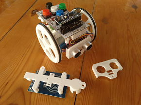
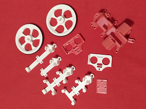

# EscornaFlex

EscornaFlex es una modificació de l'estructura original de Escornabot amb la flexibilitat de poder portar una placa de control 2.12 o 2.20, un sensor de distància per ultrasons i un lector RFID 

Realitzada per [Jordi Mayné](https://github.com/maynej) des de Mechatronic Study 

Escornabot es un projecte obert (https://escornabot.com) 

Tota la [documentació es pot trobar en PDF](https://github.com/maynej/EscornaFlex/tree/master/Doc/). Inclós en llengua castellana.

STL per imprimir [aquí](https://github.com/maynej/EscornaFlex/tree/master/stl).

## Llicència

Creative Commons Attribution-NoComercial-ShareAlike 4.0 International (CC BY-NC-SA 4.0)  
